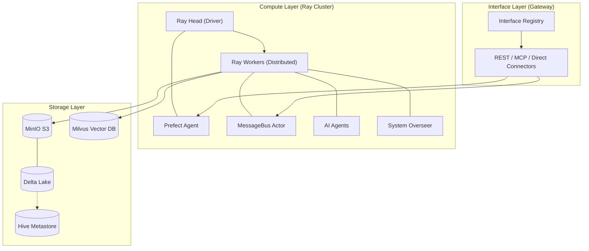

# System Architecture & Design
**Project**: AI-Native Lakehouse ETL Framework  
**Status**: Active Development  
**Last Updated**: February 17, 2026

---

## 1. High-Level Architecture
The system is designed as a **Hybrid Cloud-Native Platform** that unifies Data Engineering and AI Agents on a shared distributed substrate (Ray).

---

## 2. Implemented Design (What Works Now)

### 2.1 Infrastructure Layer (The Foundation)
-   **K0s Kubernetes**: Production-grade k8s distro on bare-metal.
    -   *Justification*: Lightweight vs EKS, but strictly compliant.
-   **MinIO + TLS**: Secure Object Storage mimicking production cloud S3.
    -   *Implementation*: Custom CA injection into all Ray Worker pods via ConfigMaps.
-   **KubeRay**: Ray Operator handling the distributed compute cluster lifecycle.

### 2.2 The ETL Framework
-   **Hybrid Execution Model**: 
    -   **Problem**: Rust `tokio` runtime conflict between Ray and `deltalake`.
    -   **Solution**: "Split-Brain" Execution. Heavy transformations run on Ray Workers (Distributed), but final storage I/O runs on the Head Node (Local) to guarantee stability.
-   **Standardized Abstractions**:
    -   `DataSource`: Common interface for Kafka, REST, WebSocket.
    -   `DataSink`: Common interface for Delta Lake, TimescaleDB.

### 2.3 The Agent Core (Internal Interaction)
-   **Hub-and-Spoke Coordination**:
    -   **Registry**: Service Discovery for agents (`find_by_capability`).
    -   **Message Bus**: Push-based, Fire-and-Forget event system.
    -   **Context Store**: Distributed Key-Value store for shared state.
-   **Data-Native Design**: Agents live on the same cluster as the data, enabling Zero-Copy memory access via Plasma Store (in theory/future).

---

## 3. To-Be-Implemented Design (Roadmap)

### 3.1 The Unified Interface Gateway
*Goal: Decouple User Access from Internal Logic*
-   **Design**: A "Protocol-Agnostic" Registry that vends adapters.
-   **Connectors**:
    1.  **Data Connector**: Pass-through SQL/Arrow access to Delta Lake.
    2.  **Compute Connector**: Submit ETL jobs to Prefect/Ray.
    3.  **Intelligence Connector**: Chat interface for Agents.
-   **Key Feature**: **MCP (Model Context Protocol)** support to allow external IDEs (Cursor/Claude) to "drive" the lakehouse.

### 3.2 System Overseer (Autonomic Computing)
*Goal: Self-Managing Platform*
-   **Design**: A specialized "Super-Agent" that monitors system health.
-   **Capabilities**:
    -   **Observability**: Monitor Kafka Lag and Ray Actor status.
    -   **Auto-Scaling**: Provision new Agent Actors if lag spikes.
    -   **Self-Healing**: Restart crashed Actors automatically.

### 3.3 Advanced Agent Capabilities
-   **RAG Integration**: Deep connection between `MilvusSink` (Vector Store) and Agent Context.
-   **Tool Use**: Formalizing the `Tool` interface so Agents can securely execute safe python code sandbox style (future).

---

## 4. Component Justification Summary

| Component | Justification | Alternatives Considered |
| :--- | :--- | :--- |
| **Ray** | Unifies Batch ETL and Stateful Agents in one runtime. | **Spark** (Good for ETL, bad for Agents) |
| **Delta Lake** | ACID transactions, Time Travel, Open Standard. | **Iceberg** (more complex setup) / **Hudi** |
| **MinIO** | S3-API Standard, High Performance. | **Ceph** (Too complex for this scope) |
| **Prefect** | Pure Python flows, Hybrid Execution support. | **Airflow** (Too rigid, DAG-only) |
| **K0s** | Zero-friction K8s on bare metal. | **K3s** / **MicroK8s** |
